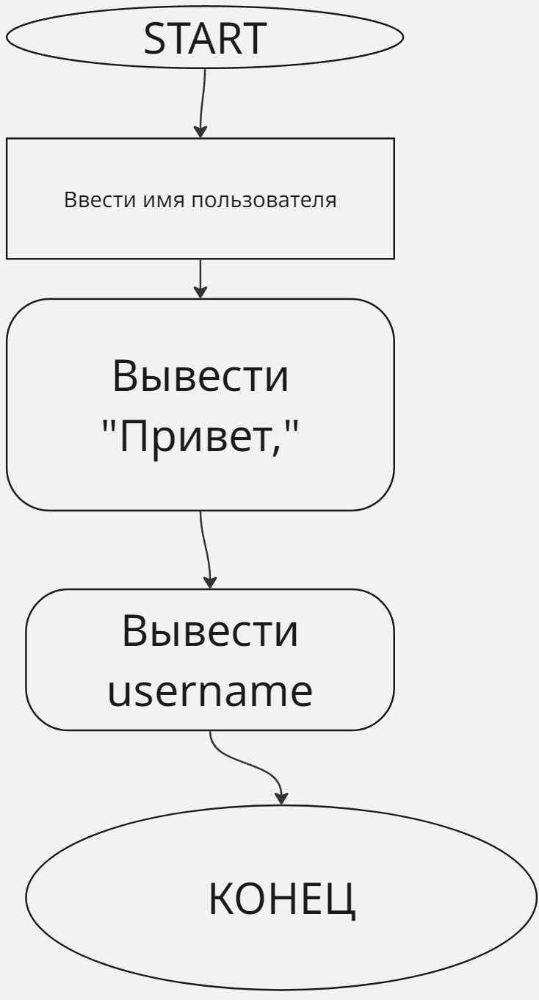
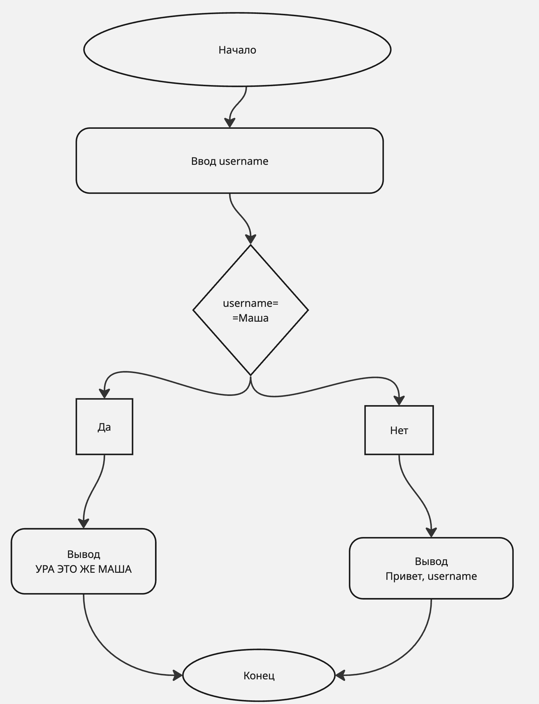

# Лекция 1

# Первые шаги написания программы

1. Получить задачу
2. Обсудить задачу
3. Уточнить условия
4. Составить алгоритм
5. Уточнить алгоритм 
6. Исправить алгоритм
7. Перепроверить алгоритм
8. Начать писать код, но это не точно

# Первые шаги

1. Установка и настройка окружения
2. Пресловутый "Hello, World!"
3. Основы синтаксиса

# Алгоритм написания Привет, мир

1. Начало
2. Вывести на экран "Привет, мир"
3. Конец

## BASH
**`dotnet new console`** - *Создание проекта*

**`dotnet run`** - *Запуск проекта*

## C#

**`//комментарий`** - *написание однострочного комментария*

**`Console.WriteLine("Привет, мир")`** - *Вывод текста*

### Сам код
**`// приветствие мира`**

**`Console.WriteLine("Привет, мир!");`**

# Алгоритм приветсвия пользователя

1. Начало
2. Ввести имя пользователя
3. Вывести "Привет, "
4. Вывести username
5. Конец

**`Console.ReadLine();`** - *считывание с терминала*

**`Console.Write("text");`** - *вывести на той же строке*

**`Console.WriteLine("text");`** - *Вывести на новой строке*

**`string username=Console.ReadLine();`** - *объявить строковую переменную и задать считать с терминала*

**`Console.WriteLine("Привет");`** - *вывод производного текста*

**`Console.Write(username);`** - *Вывод переменной*

### Код

**`Console.WriteLine("Введите имя пользователя :")`**

**`string username = Console.ReadLine()`**

**`Console.Write("Привет, ")`**

**`Console.Write(username)`**

# Написать программу сложение двух чисел

## Алгоритм

1. Начало
2. Определить первое число 
3. Определить второе число
4. Вывести сумму введенных чисел
5. Конец

**`int numberA=1;`** - *Объявление переменной int*

**`Console.Write("Сумма :")`** - *вывод на той же строке*

**`Console.WriteLine(numberA + numberB);`** - *Вывод на новой строке и суммирование двух переменных*

### КОД

**`int numberA=31;`**

**`int numberB=5;`**

**`int result=numberA+numberB;`**

**`Console.WriteLine(result);`**

# Алгоритм частного numberA/numberB

1. Начало
2. Определить первое число 
3. Определить второе число
4. Вывести частного введенных чисел
5. Конец

**`double numberA=12;`** - *объявление вещественной переменной*

### КОД

**`double numberA=12;`**

**`double numberB=5;`**

**`Console.WriteLine(numberA/numberB);`**

# Типы данных

|Тип данных|Диапозон|Размер|
|-|-|-|
|INT|от - 2 147 483 648 до 2 147 483 648|32- разрядное число со знаком|
|double|от +- 5 *10^-324 до 1.7 * 10^308|64 разрядное число со знаком|
|string|от 0 до много символов|от 4 байта до 2 гигабайт|
|bool| true или false|1 байт|

# арифмитические операции

**+** - *сложение*

**-** - *вычитание*

**/** - *деление*

**"*"** - *умножение*

**%** - *остаток от деление*

**//** - *деление на цело*

**()** - *порядок действий скобки*

# Случайное число рандоймайзер

**`new Random().Next(min,max)`** - *команда геренерации случайных чисел*

# Изменим алгоритм сложения двух чисел

### КОД

**`int numberA=new Random.Next(0,100)`**

**`int numberB= new Random.Next(0,100)`**

**`Console.WriteLine(numberA + numberB)`**

# Алгоритм особого приветсвия 

1. Начало 
2. Введите имя пользователя 
3. Если имя пользователя совпадает с именем "Маша", то особое приветсвие
4. Иначе стандратное приветсвие 
5. Конец

# Синтаксис конструкции if

**`if(условие)`**

**`{`**

**`Набор действий 1;`**
**` }`**

**`else`**

**`Набор действий 2;`** 
**`}`**

# Объяснение

**`username.ToLower();`**  - *перевод всех символов в нижний регистр*

### КОД

**`Console.WriteLine("Введите имя пользователя :");`**

**`string username=Console.ReadLine();`**

**`if (username.ToLower()=='маша')`**

**`{`**

**`Console.WriteLine("УРА! ЭТО ЖЕ МАША!")`**

**`}`**

**`else`**

**`{`**

**`Console.WriteLine("Привет, " + username)`**

**`}`**

# Задача №1 

### Дано

Дано 5 гирь с разными весами

### Найти

Найти вес самой тяжелой

### Действия которые мы можем совершать с ними

1. Взять одну или несколько гирь
2. Сравнить гири по весу
3. Поменять гири местами
4. Запомнить вес нужной фигуры

### Решение

1. Берем первую гирю и считаем, что она самая тяжелая
2. Берем вторую гирю и сравниваем ее с первой. Если она тяжелее, то она остается в статусе самой тяжелой на данный момент, если вторая тяжелее первой, то этот почетный статус занимает гиря №2
3. Берем третью гирю и сравниваем ее с самой тяжелой на даныый момент. В зависиомтси от результата сравнения из трех гирь выявляется самая тяжелая
4. Берем четвертую гирю и сравниваем ее с самой тяжелой на данный момент. В зависимости от результата сравнения берём самую тяжелую из первых четырех гирь
5. Наконец берем пятую гирю и находим самую тяжелую

### КОД

**`int a=1;`**

**`int b=8;`**

**`int c=3;`**

**`int d=2;`**

**`int e=6;`**

**`int max=a`**

**`if (b>max) max=b`**

**`if (c>max) max=c`**

**`if (d>max) max=d`**

**`if (e>max) max=e`**

**`Console.WriteLine("max=");`**

**`Console.Write(max);`**

# Одна из увлекательных задач про точки

### Дано

Есть три точки и мы их соеденяем и находим середину и так делаем до бесконечности

# Алгоритм

1. Определить три точки
2. Выбрать две лбые 
3. Найти середину 
4. Поставить точку 
5. Выбрать случайную точку треугольника
6. Соеденить её с полученной на 4 шаге точки
7. Перейти к шагу 3
8. Повторить много раз 

# Синтаксис цикла

**`while(условие продолжение)`**

**`{`**

**`набор действий 1;`**

**`}`**

**`count=0;`**

**`while(count<100)`**

**`{`**

**`Набор действий 2;`**

**`count=count+1;`**

**`}`**

# Доп команды

**`Console.Clear()`** - *очищение консоли*

**`Console.SetCursorPosition(10,4)`** - *Чтобы поставить точку и рисовать*

**`count++;`** - *для увелечения на 1*

### КОД

**`Console.Clear()`**

**`int xa=40, ya=1, xb=1, yb=30, xc=80,yc=30;`**

**`Console.SetCursorPosition(xa,ya);`**

**`Console.WriteLine("+");`**

**`Console.SetCursorPosition(xb,yb);`**

**`Console.WriteLine("+");`**

**`Console.SetCursorPosition(xc,yc);`**

**`Console.WriteLine("+");`**

**`int x=xa, y=ya;`**

**`int count=0;`**

**`while (count<100000)`**

**`{`**

**`int what = new Random.Next(0,2);`**

**`if what=0;`**

**`{`**

**`x=(x+xa)/2;`**

**`y=(y+ya)/2;`**

**`}`**

**`if what=1;`**

**`{`**

**`x=(x+xb)/2;`**

**`y=(y+yb)/2;`**

**`}`**

**`if what=1;`**

**`{`**

**`x=(x+xc)/2;`**

**`y=(y+yc)/2;`**

**`}`**

**`Console.SetCursorPosition(x,y);`**

**`Console.WriteLine("+");`**

**`count++;`**

**`}`**
